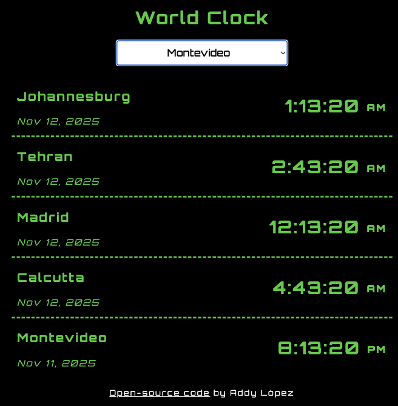

# World Clock

**_View this project:_** [https://worldclock-al.netlify.app/](https://worldclock-al.netlify.app/)

## Description & Usage

This digital world clock application was built in HTML, CSS, and JavaScript. Accurate date and time formatting across numerous timezones was streamlined by integrating the Moment.js library (attribution below).

To use the application, select a city from the drop-down select menu. A digital clock updated every second will display below. Repeat these instructions to add new clocks to the display! Refresh the app to start over with a clean slate.

## Coding Features

- **_JavaScript:_** streamlined date and time formatting across numerous time zones using Moment.js, dynamic injection of world clock instances based on select menu, time updated every second using the setInterval() function, explanatory annotations provided, logging statements to test the app's behavior at every stage of operation

- **_CSS:_** responsive web design for screens of all sizes, custom font, flexbox techniques employed for responsive spacing and styling, retro digital design

- **_HTML:_** accessible semantic tags, form handling of select menu with numerous options, logical structure, text injection into HTML via JavaScript

- **_UI/UX Considerations_**: accessible and responsive web design, redundant clocks from the same selected city averted from appearing in the results, neat instructions for usage provided to guide user's behavior based on clear expectations

- Coded in VS Code with tools for a **_professional development workflow, version control, and continuous deployment_**, such as Live Server, Git, GitHub, and hosting on Netlify

## Accessibility Rating

- **_Accessibility rating_** by Lighthouse audit: 90/100 for desktops, 90/100 for mobile devices.

## Project Previews

## Attribution

- Moment.js Documentation: [https://momentjs.com/](https://momentjs.com/)
- Moment.js CDN: [https://cdnjs.com/libraries/moment.js](https://cdnjs.com/libraries/moment.js)
- List of all Moment JS timezones: [https://gist.github.com/diogocapela/12c6617fc87607d11fd62d2a4f42b02a](https://gist.github.com/diogocapela/12c6617fc87607d11fd62d2a4f42b02a)
